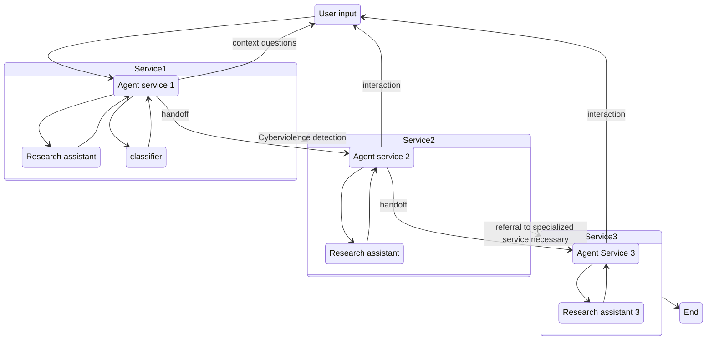
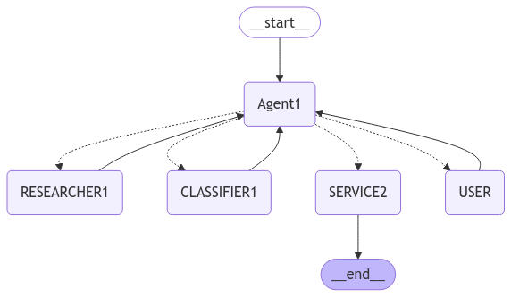

# Data for Good Saison 13 - Stop Cyber

# Cahier de charges

## Prospective design

## Implementation

J’ai choisi `langgraph` en combinaison avec `langchain`. Les deux
open-source, documentations extensive, bcp de tutos.

Le modele utilise est `GPT-4o-mini` de `OpenAI`, aucune raison
specifique.

Pour un premier draft je me suis inspire (entre autre) de cet
[article](https://ai.gopubby.com/building-rag-research-multi-agent-with-langgraph-1bd47acac69f)

## Premier draft

Pour le premier draft on se focalise sur le service 1 “Aide a la
reponse”

**Etat actuel**

Le routage est en place, pour l’instant j’ai l’impression qu’on doit
forcer l’agent de soliciter le RESEARCHER ou le CLASSIFER (du genre
demander directement). Ceci peut etre une question de choix de modele
et/ou une question du SYSTEM_PROMPT. J’ai modifie celle de Valentin qui
pour l’instant me semble encore trop cible “Prise en charge de
cyberviolence” et pas trop “Aide a la reponse”.

Mes modifications portent surtout sur le routage.

**Ce qui manque**

- [ ] mise en place de la BDD des documents pour RESEARCHER
- [ ] procedure de retrival des infos
- [ ] modele de classification du dataset
  [\`cyberagressionado-v1](https://hatespeechdata.com/#cyberagressionado-v1)
- [ ] procedure pour que CLASSIFIER1 puisse se servir du modele de
  classification (peut-etre ce sera plutot un tool pour AGENT1 qu’un
  agent specialise)
