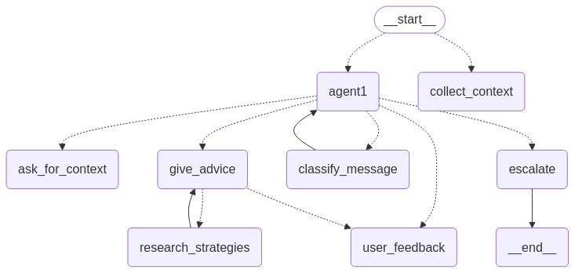

# Data for Good Saison 13 - Stop Cyber

# Cahier de charges

## Prospective design

# Update 12/03/2025

## Implementation

J’ai choisi `langgraph` en combinaison avec `langchain`. Les deux sont
open-source, avec une documentation extensive et de nombreux tutoriels
disponibles.

Pour un premier draft, je me suis inspiré (entre autres) de cet
[article](https://ai.gopubby.com/building-rag-research-multi-agent-with-langgraph-1bd47acac69f).

Pour le premier draft, nous nous concentrons sur le service 1 “Aide à la
réponse”.

Le modèle utilisé est ~~`GPT-4o-mini` de `OpenAI`sans raison
spécifique.~~ `Gemini 2.0 Flash` pour sa fenêtre de contexte très large.
Avec `GPT-4o-mini`, on arrivait déjà à la limite ce qui reste suspicieux
(code à vérifier). Les calls de API passe maintenant par `OpenRouter`,
cela permet de facilement changer les modèles pour un prototypage
rapide. Potentiellement, on pourra envisager d’utiliser différents
modèles pour différents tâches.

**État actuel**

Le routage fonctionne (par exemple, “je me sens en danger” active la
voie ‘escalate’), à vérifier en language ados.

~~Pour l’instant, j’ai l’impression que nous devons forcer l’agent à
solliciter le RESEARCHER ou le CLASSIFIER (du genre à demander
directement).~~

Chaque node a un prompt qui reste à definir/améliorer.

**TODO**

### Agent

- [x] Le début de l’échange doit être amélioré (le bot doit se présenter
  et préparer le terrain).
- [x] `agent1` doit probablement etre converti en simple point de
  routage
- [ ] definition des informations contextuelle minimales

### Situational context

Pour bien comprendre la situation qui a conduit le jeune / ado à
soliciter le chatbot, on a besoin des infos suivants:

- Rôle du jeune: Expéditeur (potentitiel), destinataire ou témoin
- Le canal de communication par lequel le message est arrivé chez le
  jeune
- Le ressenti que le message a évoqué

**Implementation**

Deux solutions semblent envisageables:

1.  Séries des questions déterminstes au début de l’échange, les infos
    sont enregistré dans dictionnaire
2.  Défintion d’un dictionnaire avec des champs prédefinis, la collecte
    des informations est laissé au LLM

Dans les deux cas, les informations devront être injectés dans les
system prompts.

### RAG pour `research_strategies`

On part pour une exploration de
[`kotaemon`](https://github.com/Cinnamon/kotaemon/tree/main), un
open-source RAG tool. Ce qui sera probablement le plus intéressant, sont
les procédures de traitement des documents, les embeddings, le stockage
et le retrieval.

Est-ce qu’on ne garderait pqs l’UI `kotaemon` pour la gestion des
documents ?

- [ ] Liste des documents à ingérer
- [ ] Quel vectorstore ?
- [ ] Procédure de retrieval des informations.

### NLP message classifier (priorite moindre)

- [ ] Modèle de classification du dataset
  [`cyberagressionado-v1`](https://hatespeechdata.com/#cyberagressionado-v1).
- [ ] Procédure pour que CLASSIFIER1 puisse se servir du modèle de
  classification (peut-être ce sera plutôt un outil pour AGENT1 qu’un
  agent spécialisé).

### Interface graphique

- [x] Interface graphique de base en place, implementé avec `chainlit`
- [x] support envoi capture d’ecran
- [ ] Customisation ….

**Exemple d’un échange**

    Enter your query (type '-q' to quit):
    > ================================== Ai Message ==================================

    I understand that you're feeling upset about what happened. It's really important to talk about it. Can you tell me more about what was said or done? This will help me understand the situation better.

    ---
     Routed to:  USER
    ---

    > : ================================ Human Message =================================

    hi, est-ce qu'on peut discuter en francais ?

    ================================== Ai Message ==================================

    Bien sûr, nous pouvons discuter en français ! Je suis là pour t'aider. Peux-tu me dire ce qui te préoccupe ?

    ---
     Routed to:  USER
    ---

    > : ================================ Human Message =================================

    j'ai recu un message de qqn que je connais pas vraiment. je comprends pas trop ce que ca veut dire

    ================================== Ai Message ==================================

    Je comprends que recevoir un message d'une personne que tu ne connais pas peut être déroutant et même un peu inquiétant. Peux-tu me dire ce que le message disait ? Cela m'aidera à mieux comprendre la situation et à te donner des conseils appropriés.

    ---
     Routed to:  USER
    ---

    > : ================================ Human Message =================================

    il m'a dit que je suis moche

    ================================== Ai Message ==================================

    Je suis vraiment désolé d'apprendre que tu as reçu un message aussi blessant. C'est très injuste et tu ne mérites pas d'être traité de cette façon. Les commentaires comme celui-ci sont une forme de cyberharcèlement, et c'est important de se rappeler que ce n'est pas de ta faute.

    Voici quelques étapes que tu peux suivre :
    1. **Ne réponds pas** à ce message. Parfois, ignorer les personnes qui essaient de te blesser est la meilleure chose à faire.
    2. **Prends une capture d'écran** du message pour garder une preuve de ce qui a été dit.
    3. **Bloque la personne** sur la plateforme où tu as reçu le message. Cela peut t'aider à te sentir plus en sécurité.
    4. **Parle-en à un adulte de confiance**, comme un parent, un enseignant ou un conseiller scolaire. Ils peuvent t'aider à gérer la situation.

    N'oublie pas que tu n'es pas seul et qu'il y a des gens qui se soucient de toi et qui peuvent t'aider. Tu es précieux et tu mérites d'être traité avec respect !

    ---
     Routed to:  USER
    ---

    > : ================================ Human Message =================================

    tu me conseilles de faire quoi?

    ================================== Ai Message ==================================

    Je te conseille de suivre ces étapes :

    1. **Ne réponds pas** au message. Ignorer les personnes qui essaient de te blesser est souvent la meilleure option.
    2. **Prends une capture d'écran** du message pour garder une preuve de ce qui a été dit. Cela peut être utile si tu en parles à un adulte.
    3. **Bloque la personne** sur la plateforme où tu as reçu le message. Cela peut t'aider à te sentir plus en sécurité et à éviter d'autres messages blessants.
    4. **Parle-en à un adulte de confiance**, comme un parent, un enseignant ou un conseiller scolaire. Ils peuvent t'aider à gérer la situation et à te soutenir.

    N'oublie pas que tu n'es pas seul et qu'il y a des gens qui se soucient de toi et qui peuvent t'aider. Tu es précieux et tu mérites d'être traité avec respect !

    ---
     Routed to:  USER
    ---

    > : ================================ Human Message =================================

    tu crois que c'est du cyberharcelement?

    ================================== Ai Message ==================================

    Oui, ce que tu as décrit ressemble à du cyberharcèlement. Quand quelqu'un t'envoie des messages blessants ou méchants, cela fait partie des comportements de harcèlement en ligne. C'est important de se rappeler que ce n'est pas de ta faute et que tu ne mérites pas d'être traité de cette manière.

    Si tu veux, je peux t'aider à prendre des mesures pour te protéger et te sentir mieux. Que souhaites-tu faire ?

    ---
     Routed to:  CLASSIFIER1
    ---

    ================================== Ai Message ==================================

    Clearly cyberviolence

    ================================== Ai Message ==================================

    Je pense qu'il est important de prendre cette situation au sérieux. Étant donné que tu as reçu un message blessant et que cela ressemble à du cyberharcèlement, je vais transférer ton cas à un service spécialisé qui pourra t'aider davantage. Ils pourront te fournir le soutien dont tu as besoin.

    N'oublie pas que tu n'es pas seul et qu'il y a des gens qui se soucient de toi. Je vais maintenant te transférer à ce service.

    ---
     Routed to:  SERVICE2
    ---

    ================================== Ai Message ==================================

    Service 2 not yet implemented

